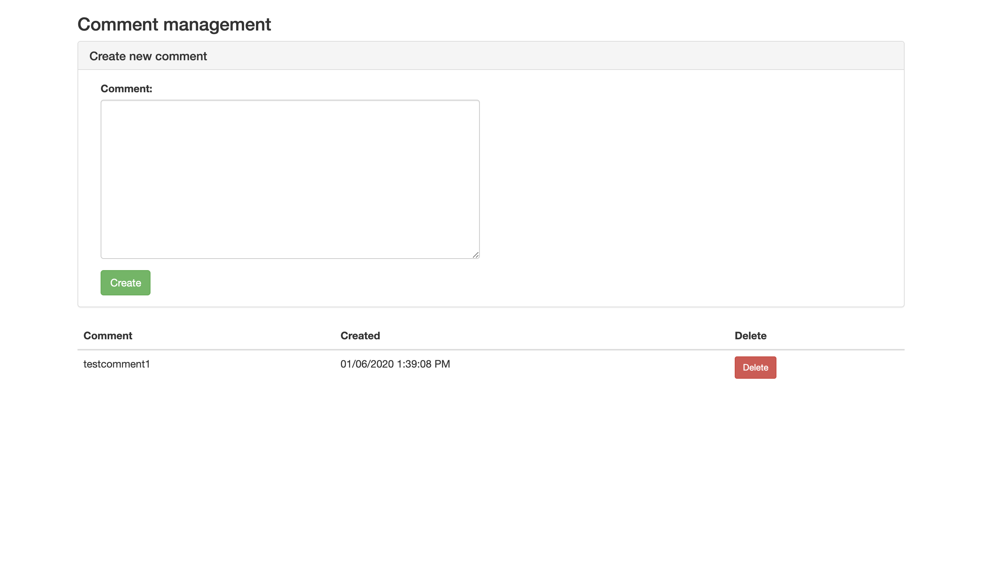

# Introduction

This repository contains a coding test aimed to test your knowledge of React/Redux to go along with a Django backend.

Your assignment is to implement the frontend task and make a pull request after completion. Please do **NOT** fork this repository - simply push a new branch under the codetest repository.

# Backend

The start the Django server:
1. `python3 -m venv env`
2. `source env/bin/activate`
3. `make run`

To view Swagger documentation for the API, navigate to `http://localhost:8000/docs` in your browser.

# Frontend

The frontend task is to implement the UI portion of a CRUD interface for comments.  After completing the assignment, the frontend should support the following features:

* create a new comment (and append that to all comments)
* list all comments
* delete a comment
* modify a existing comment (you can use any popup for this)

The frontend should be coded with React and Redux. Please refer to `Makefile` on how to start frontend development.

The final UI should something like this:

